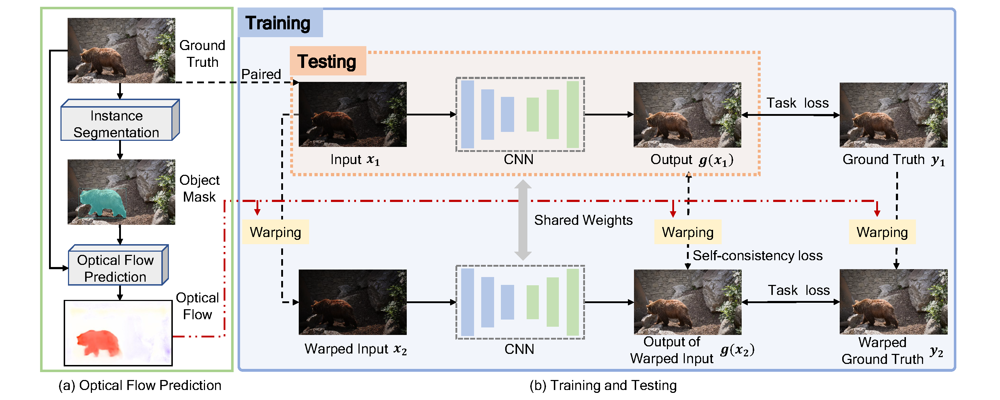

# StableLLVE
This is a Pytorch implementation of "Learning Temporal Consistency for Low Light Video Enhancement from Single Images" in CVPR 2021, by Fan Zhang, Yu Li, Shaodi You and Ying Fu.

**[Paper](https://openaccess.thecvf.com/content/CVPR2021/papers/Zhang_Learning_Temporal_Consistency_for_Low_Light_Video_Enhancement_From_Single_CVPR_2021_paper.pdf) and [Supplemental](https://openaccess.thecvf.com/content/CVPR2021/supplemental/Zhang_Learning_Temporal_Consistency_CVPR_2021_supplemental.pdf)**




## Requirements ##
- [x] python 3.6.9
- [x] Pytorch 1.5.0
- [x] opencv-python 3.4.2

## Usage ##
#### Training
First, prepare your own traning data and put it in the folder `./data`. By default, the code takes input images and ground truth from `./data/train` and `./data/gt` and you can also change the path in `train.py` and `dataloader.py`.

Second, you need to predict plausible optical flow for your ground truth images and put it in the folder `./data/flow`. In our paper, we first perform instance segmentation to get object masks using the opensource toolkit **[detectron2](https://github.com/facebookresearch/detectron2)**. Then we utilize the pretrained **[CMP](https://github.com/XiaohangZhan/conditional-motion-propagation)** model to generate the optical flow we need. (A naive prediction code will be here soon.)

Finally, you can train models on your own data by running
```shell
cd StableLLVE
python train.py 
```
You can replace the U-Net with your own model for low light image enhancement. The model will be saved in the folder `./logs`.

#### Testing
You can put your test images into the folder `./data/test` and just run
```shell
cd StableLLVE
python test.py
```

## Model ##
- [x] checkpoint.pth (This model is trained with the synthetic clean data reported in the paper. It may be unsuitable for noisy data.)


## Bibtex ##
If you find this repo useful for your research, please consider citing our paper.
```
@InProceedings{Zhang_2021_CVPR,
    author    = {Zhang, Fan and Li, Yu and You, Shaodi and Fu, Ying},
    title     = {Learning Temporal Consistency for Low Light Video Enhancement From Single Images},
    booktitle = {Proceedings of the IEEE/CVF Conference on Computer Vision and Pattern Recognition (CVPR)},
    month     = {June},
    year      = {2021},
    pages     = {4967-4976}
}
```
